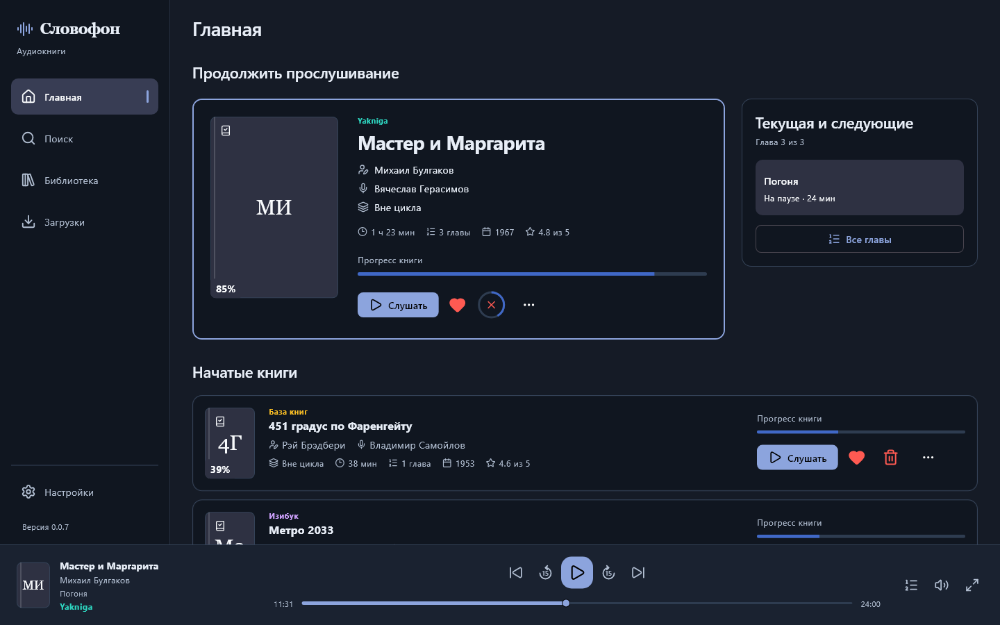
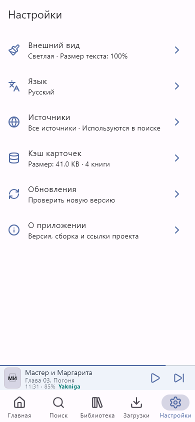
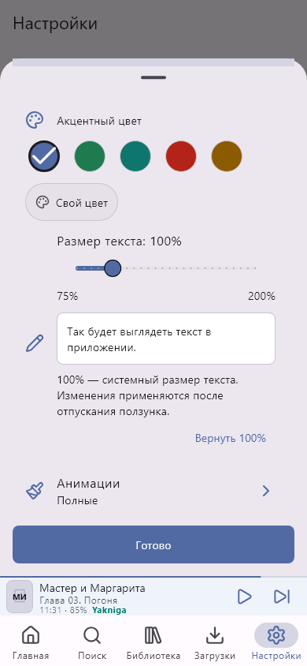
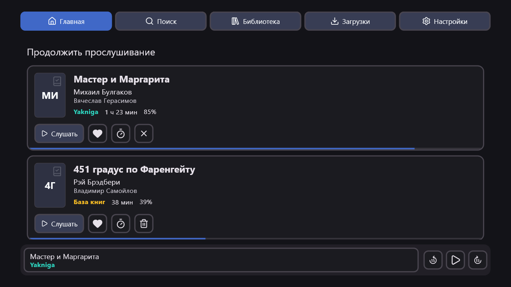
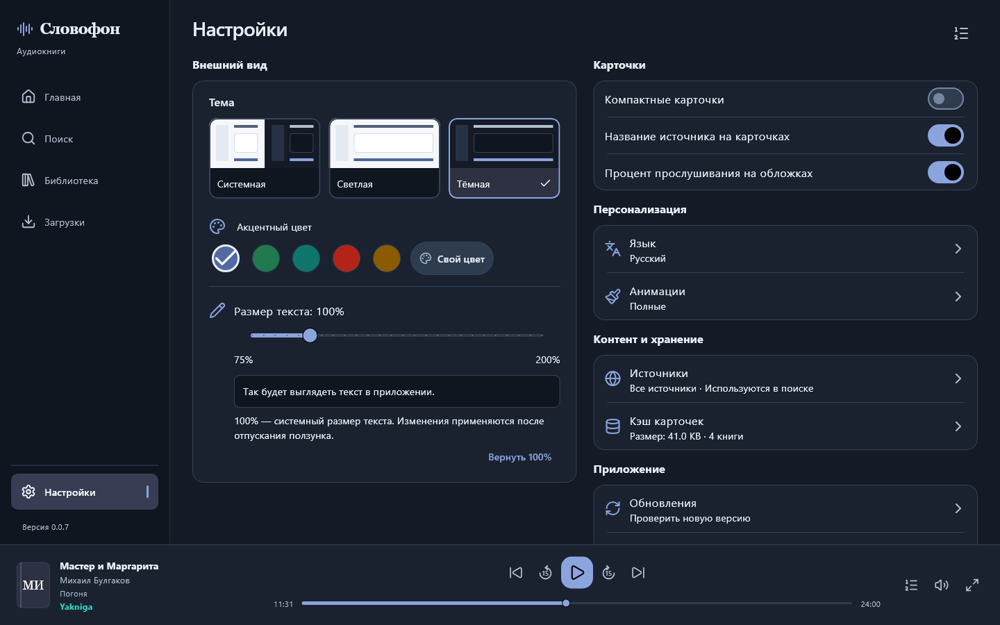

<a name="readme-top"></a>

<p align="center">
  
</p>

<h1 align="center">Словофон · Slovofon</h1>

<p align="center">
  <strong>Поиск, прослушивание и офлайн-загрузка аудиокниг из нескольких источников</strong><br>
  Android · Android TV · Windows<br>
  Найдите книгу, выберите чтеца, продолжите с сохранённого места.
</p>

<p align="center">
  <a href="VERSION"></a>
  <a href="https://github.com/Dushnyj/Slovofon/releases"></a>
  <a href="#platforms"></a>
  <a href="https://github.com/Dushnyj/Slovofon/actions/workflows/ci.yml"></a>
  <a href="LICENSE"></a>
</p>

<p align="center">
  <a href="https://github.com/Dushnyj/Slovofon/releases"><strong>Скачать приложение</strong></a>
  &nbsp;•&nbsp;
  <a href="docs/GETTING_STARTED.md"><strong>Быстрый старт</strong></a>
  &nbsp;•&nbsp;
  <a href="docs/README.md"><strong>Документация</strong></a>
  &nbsp;•&nbsp;
  <a href="https://github.com/Dushnyj/Slovofon/issues/new/choose"><strong>Сообщить о проблеме</strong></a>
</p>

<p align="center">
  <strong>Навигация</strong><br>
  <a href="#overview">О приложении</a> ·
  <a href="#quick-start">Быстрый старт</a> ·
  <a href="#interface">Интерфейс</a> ·
  <a href="#features">Возможности</a> ·
  <a href="#sources">Источники</a><br>
  <a href="#platforms">Платформы</a> ·
  <a href="#updates">Обновления</a> ·
  <a href="#limitations">Ограничения</a> ·
  <a href="#documentation">Документация</a> ·
  <a href="#development">Разработка</a>
</p>

<a href="docs/assets/readme/windows-home.png">
  
</a>
<p align="center"><sub>Windows · продолжение прослушивания и главы рядом. Тестовые данные, без пользовательской истории.</sub></p>

---

<a name="overview"></a>
## О приложении

Словофон объединяет поиск по нескольким каталогам, выбор озвучки, плеер и личную
библиотеку. Автор и чтец показываются отдельно, а название и цвет источника помогают
различать версии одной книги — в результатах поиска, карточке и плеере.

**Книга остаётся в центре:** слушайте онлайн, сохраняйте главы для офлайн-доступа,
добавляйте закладки и возвращайтесь к последней позиции на том же устройстве.

README описывает текущие исходники **0.0.7**. Опубликованные сборки могут отставать
от них: доступную версию и файлы смотрите в [GitHub Releases](https://github.com/Dushnyj/Slovofon/releases).
Переход на 0.0.7 сам по себе не означает публикацию релиза или завершение всего ТЗ.

<a name="quick-start"></a>
## Быстрый старт

1. Откройте [релизы](https://github.com/Dushnyj/Slovofon/releases) и выберите файл:

   | Устройство | Что скачать |
   | --- | --- |
   | Android-телефон или планшет | `Slovofon-v<version>-android-universal-release.apk` |
   | Android TV | Тот же universal APK из версии с TV-интерфейсом; отдельное приложение не требуется |
   | Windows 10/11 x64 | `Slovofon-v<version>-windows-x64-setup.exe` |
   | Windows без установки | `…-windows-x64-portable.zip`, если он приложен к выбранному релизу |

2. Установите приложение и откройте **Поиск**.
3. Введите название книги, автора или чтеца. Уточнить поиск можно фильтрами.
4. Откройте нужную версию книги и нажмите **Слушать**.
5. Для офлайн-прослушивания загрузите книгу или отдельные главы и дождитесь завершения.

> [!CAUTION]
> **Windows-версия и её установщик пока не имеют цифровой подписи.** При первом запуске
> Microsoft Defender SmartScreen может показать сообщение **«Система Windows защитила
> ваш компьютер»**, а в поле издателя — **«Неизвестный издатель»**.
>
> Скачивайте файлы только из [официальных GitHub Releases](https://github.com/Dushnyj/Slovofon/releases)
> и сверяйте SHA-256 с `SHA256SUMS.txt` того же выпуска. Если вы доверяете скачанному файлу
> и хотите продолжить запуск, нажмите **«Подробнее» → «Выполнить в любом случае»**.
> Отключать SmartScreen или антивирус не требуется. Если кнопки запуска нет,
> её может запрещать политика устройства — эта инструкция не обходит такое ограничение.

Пошаговые инструкции по платформам, обновлению и первым действиям:
**[Начало работы со Словофоном](docs/GETTING_STARTED.md)**.

<a name="interface"></a>
## Интерфейс

Один набор книг и функций — разные способы управления. На телефоне используются
сенсорные элементы и нижняя навигация, на TV — пульт и заметный фокус, на Windows —
боковое меню, мышь и клавиатура.

<p align="center">
  <a href="docs/assets/readme/android-settings.png"></a>
  &nbsp;
  <a href="docs/assets/readme/android-appearance.png"></a>
</p>
<p align="center"><sub>Android · настройки и персонализация</sub></p>

<details>
<summary><strong>Android TV и настройки Windows</strong></summary>

<br>

<a href="docs/assets/readme/android-tv-home.png">
  
</a>
<p align="center"><sub>Android TV · отдельная компоновка для управления пультом</sub></p>

<a href="docs/assets/readme/windows-settings.png">
  
</a>
<p align="center"><sub>Windows · параметры оформления без цепочки вложенных диалогов</sub></p>

</details>

Снимки получены из настоящих Flutter-виджетов на локальных тестовых данных.
Это не дизайн-макеты, но и не фотографии Android-устройств: системные шрифты,
клавиатура и оболочки могут отличаться. [Как получены изображения](docs/assets/readme/README.md).

<a name="features"></a>
## Возможности

| Задача | Что доступно |
| --- | --- |
| **Найти книгу** | Поиск по названию, автору, чтецу, циклу и жанру; история, фильтры и сортировка |
| **Выбрать озвучку** | Автор и чтец отдельно, источник, главы, описание и другие озвучки, когда источник передаёт эти данные |
| **Слушать** | Постоянный плеер, полный экран, переход по главам, перемотка, скорость и таймер сна |
| **Вернуться позже** | Сохранённая позиция, прогресс, избранное, «Позже», история и закладки |
| **Слушать без сети** | Загрузка книги или глав, очередь, пауза, продолжение и повтор после ошибки |
| **Настроить под себя** | Светлая/тёмная/системная тема, свой акцент, текст 75–200%, анимации и вид карточек |
| **Выбрать каталоги** | Настройка источников, участвующих в поиске |

Загруженные файлы, настройки и прогресс хранятся локально.
**Синхронизации между телефоном, TV и ПК пока нет.**

<a name="sources"></a>
## Источники

Реализованы шесть коннекторов: **Изибук, Akniga, Yakniga, Книга в ухе,
Книгоблуд и База книг**. Они подключены к поиску, карточкам, разрешению
аудиоссылок, плееру и загрузкам.

Набор метаданных и доступность записи зависят от источника. Фрагмент книги
обозначается как фрагмент; наличие одного файла не означает полной версии.
Изменения сайта или ограничения сети могут временно нарушить работу коннектора.

Архитектура, возможности и ограничения: [Источники](docs/SOURCES.md).

<a name="platforms"></a>
## Платформы

| Платформа | Интерфейс и управление | Граница проверки |
| --- | --- | --- |
| **Android 7.0+** | Телефоны и планшеты, touch, системная media session | Код, widget-тесты и Debug-сборка; сценарии устройства — по чеклисту |
| **Android TV на Android 7.0+** | TV launcher, D-pad/Select, крупные кнопки, безопасные поля | TV определяется средствами Android, не по ширине; пульты и launcher требуют проверки на устройстве |
| **Windows 10/11 x64** | Desktop layout, dock, мышь, локальные shortcuts, минимум 900×600 | Проверены работающее окно, resize и крупный текст; это не проверка всех DPI и конфигураций ПК |

Подробнее: [проверка качества](docs/CROSS_PLATFORM_QUALITY.md) и
[чеклист Android / Android TV](docs/MANUAL_DEVICE_QA_RU.md).

<a name="updates"></a>
## Обновления

В **Настройках → Обновления** приложение проверяет новые стабильные версии напрямую
в [GitHub Releases](https://github.com/Dushnyj/Slovofon/releases).
Промежуточный update-сервер не используется.

Перед открытием установщика загруженный APK или Windows setup проверяется по
**SHA-256**. Ожидаемая сумма берётся из metadata файла на GitHub либо
`SHA256SUMS.txt` того же релиза. Без валидной суммы установка не продолжается.
Проверка не заменяет системную проверку подписи APK.

<a name="limitations"></a>
## Что ещё в работе

- Отдельное окно Windows mini-player, tray и полная системная media-интеграция.
  Нынешний dock находится внутри главного окна.
- Голосовой поиск на TV и проверка разных физических пультов.
- Настройки Wi-Fi-only, папки/квоты загрузок и автоматический retry/backoff.
- Пользовательские proxy-профили и собственный MediaProxyService.
- Полная UI-пагинация всех источников и настоящая отмена HTTP-запросов.

Полный список технических ограничений и непроверенных сценариев не скрыт:
[отчёт о качестве](docs/CROSS_PLATFORM_QUALITY.md). Техническое задание описывает
также будущие функции, а не только уже доступные.

<a name="support"></a>
## Поддержка и обратная связь

- [Сообщить об ошибке](https://github.com/Dushnyj/Slovofon/issues/new?template=bug_report.yml).
- [Предложить улучшение](https://github.com/Dushnyj/Slovofon/issues/new?template=feature_request.yml).
- [Как подготовить полезное обращение](SUPPORT.md).

Укажите платформу, версию, шаги и ожидаемый результат. Для визуальных проблем —
размер окна/экрана, тему и оба масштаба текста. Для проблемы каталога — название
источника и книги, без временных media URL, cookies или токенов.

Правила работы с данными и секретами: [Безопасность](docs/SECURITY.md).

<a name="documentation"></a>
## Документация

| Пользователю | Разработчику |
| --- | --- |
| [Начало работы](docs/GETTING_STARTED.md) | [Архитектура](docs/ARCHITECTURE.md) |
| [Установка и обновление](docs/GETTING_STARTED.md#обновления) | [Окружение, сборка и релизы](docs/BUILD_RELEASE.md) |
| [Поддержка](SUPPORT.md) | [Источники и коннекторы](docs/SOURCES.md) |
| [Проверка телефона и TV](docs/MANUAL_DEVICE_QA_RU.md) | [Темы и адаптивный интерфейс](docs/THEMING.md) |
| [История изменений](CHANGELOG.md) | [Правила участия](CONTRIBUTING.md) |

**[Вся документация →](docs/README.md)**

<a name="development"></a>
## Разработка

Flutter + Dart. CI использует Flutter **3.44.0 stable**, Android-сборка — JDK **17**.
Для Windows нужны Visual Studio Build Tools с C++ и Windows SDK.
Точные зависимости и bootstrap описаны в [руководстве сборки](docs/BUILD_RELEASE.md).

```powershell
git clone https://github.com/Dushnyj/Slovofon.git
cd Slovofon
./tools/slovofon.ps1 bootstrap
./tools/slovofon.ps1 check
```

<details>
<summary><strong>Локальные проверки и Debug-сборки</strong></summary>

```powershell
./tools/slovofon.ps1 format
./tools/slovofon.ps1 analyze
./tools/slovofon.ps1 test

./tools/slovofon.ps1 build -Target android -Configuration debug
./tools/slovofon.ps1 build -Target windows -Configuration debug
```

Общий скрипт — `tools/slovofon.ps1`. Обычная сборка не меняет версию,
не создаёт тег и не публикует релиз. Debug-артефакты CI не являются release-сборками.

Перед изменениями прочитайте [CONTRIBUTING.md](CONTRIBUTING.md);
для ИИ-агентов обязательны [AGENTS.md](AGENTS.md).

</details>

## Лицензия

[Apache License 2.0](LICENSE) · [NOTICE](NOTICE) ·
[Сторонние компоненты](THIRD_PARTY_NOTICES.md).

---

<p align="center">
  <a href="https://github.com/Dushnyj/Slovofon/releases">Релизы</a> ·
  <a href="CHANGELOG.md">Изменения</a> ·
  <a href="docs/README.md">Документация</a> ·
  <a href="SUPPORT.md">Поддержка</a> ·
  <a href="docs/SECURITY.md">Безопасность</a>
</p>
<p align="center"><a href="#readme-top">Наверх ↑</a></p>
